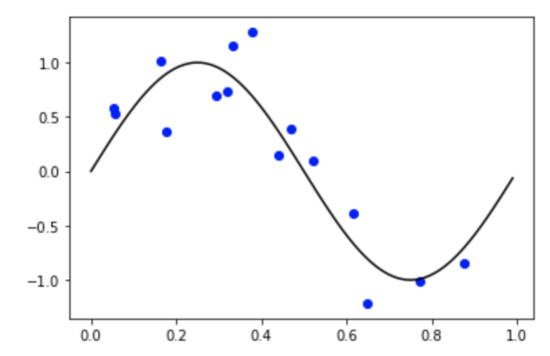

## Basic Terminology

  hand written digit code example.
  손글씨로 쓴 숫자를 정확하게 인식하는 테스크를 룰베이스로 풀려는 것보다 모델이 스스로 패턴을 찾게하여 머신러닝으로 푸는 것이 나음.
  - training set : 카테고리 레이블링 된 인풋 데이터 셋. Used for tuning the parameters of an adaptive model. 
  - target vector t : 분류하고자하는 카테고리를 나타내는 벡터. 이 예시에서는 해당하는 corresponding digit 숫자를 나타내는 벡터들.
  
  각각의 인풋 x에는 타겟벡터 t는 하나씩만 있다.(손글씨 사진 하나는 하나의 숫자 레이블만을 가짐)
  
  
  ### "머신러닝 알고리즘은 함수 y(x)로 나타낼 수 있다. 인풋 x가 들어오면 y벡터를 생성하는 함수로, y벡터는 타겟벡터와 같은 방식으로 인코딩된다. 이 함수의 구체적인 형태는 트레이닝 과정에서 결정된다."
  
  
  - test set : 모델을 트레이닝 하는 단계에서 모델이 보지 못한 데이터로 모델의 성능을 판별하기 위해 learning phase 종료 후 사용.
  - generalization : training set의 데이터와 형태가 다른 unseen data도 잘 판별하도록 모델 일반화하는 것이 매우 중요.
  - pre-processing/feature extraction : 효율적인 트레이닝을 위해 특정한 형태로 인풋데이터를 가공한다. 테스트 데이터와 트레이닝 데이터는 반드시 같은 방식으로 프로세싱해야한다. real-time 디텍션 같은 경우 등에서 보듯이 computation 경량화를 목적으로 사용되기도 한다.
  
  - Supervised Learning : 인풋 벡터에 각각 해당하는 타겟 벡터 존재.
  - Classification Problem : 각각의 인풋벡터는 finite and discrete categories 중 하나에 소속.
  - Regression Problem : 아웃풋이 하나 또는 그 이상의 continous varialbe인  경우.
  
  - Unspervised Learning : 타겟벡터 x. 비슷한 그룹을 찾는 clustering 문제나 인풋 스페이스 내 데이터의 분포를 결정하는 density estimation, 시각화를 위해 고차원 데이터의 차원 축소 등이 이에 해당한다.
  
  - Reinforcement Learning : 주어지 상황에서의 리워드를 최대화하기 위해 suitable actions 선택하는 문제. trial and error로 학습. states and actions 시퀀스가 존재하고 서로  상호작용한다. 대부분의 경우 현재 액션은 당장의 리워드 외에도 후행하는 모든 스텝의 리워드에 영향을 미친다.
  
* * *

## Polynomial Curve Fitting

실수인 input variable x를 통해 실수인 target variable t를 예측하고자 한다. 

### 예시 데이터셋 합성
앞으로 여러번 예시에 사용할 인위적인 데이터셋을 만든다. 

input values {x} = uniformly generated numbers in range (0,1)

corresponding target values {t} = corresponding values of sin(2*pi*x) 

with random noise with Gaussian distribution having 0.3 std variation

교재에 나오는 그래프를 파이썬을 이용해 직접 그려보자.
교재에서는 데이터포인트를 10개만 사용했지만 15개를 사용해 그려보았다.

~~~python
import random
import numpy as np
import matplotlib.pyplot as plt

## Generate data x and t
x = [random.random() for x in range(0,15)]
t = [math.sin(item*2*np.pi) for item in x]

## Generate and add noise to the data
noise = np.random.normal(0,0.3,15)
type(noise)
t = t+noise

x_sin=np.arange(0,1,0.01)
y_sin=np.sin(x_sin*2*np.pi)

plt.scatter(x,t, color='b')
plt.plot(x_sin,y_sin,color='black')
plt.plot()
~~~
위 코드를 통해 다음과 같은 그래프를 그릴 수 있습니다.

{: width="300" height="200"}

* * *
